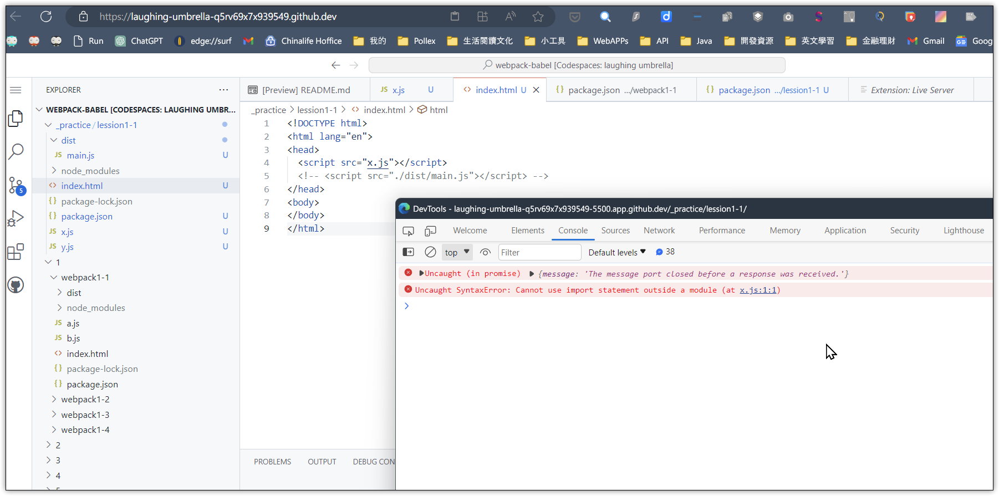
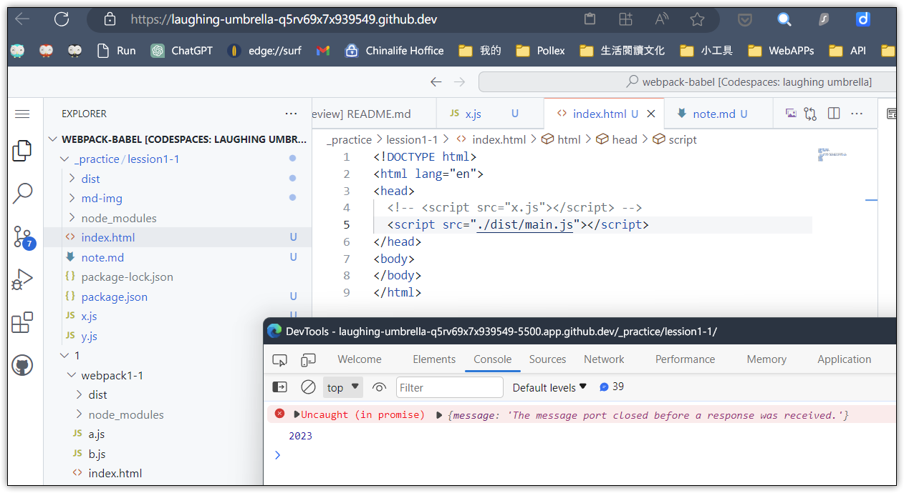
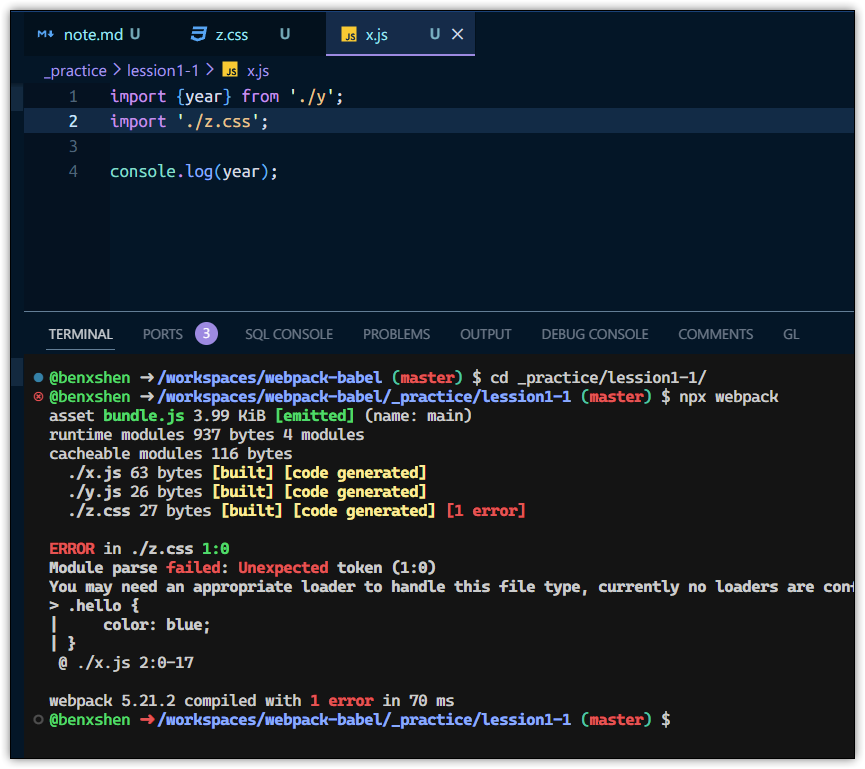

✔️ 直接引用 x.js 會出現的錯誤結果


✔️ 使用指令 "`npx webpack --entry ./x.js -o dist`" ，並且引用 dist/main.js 之後的結果

```javascript
// dist/main.js
(()=>{"use strict";console.log(2023)})();
```



➡️ 使用指令 "`npx webpack --entry ./x.js -o dist`" 因缺少 "`mode`" 參數，出現的警告訊息

```bash
@benxshen ➜ /workspaces/webpack-babel/_practice/lession1-1 (master) $ npx webpack --entry ./x.js -o dist
asset main.js 41 bytes [emitted] [minimized] (name: main)
orphan modules 26 bytes [orphan] 1 module
./x.js + 1 modules 71 bytes [built] [code generated]

⚠️ WARNING in configuration
The 'mode' option has not been set, webpack will fallback to 'production' for this value.
Set 'mode' option to 'development' or 'production' to enable defaults for each environment.
You can also set it to 'none' to disable any default behavior. Learn more: https://webpack.js.org/configuration/mode/
```

✔️ 使用 `webpack.config.js` 取代 cli 命令列參數
```js
const path = require('path');

module.exports = {
    entry: './x.js',
    output: {
        path: path.resolve(__dirname, 'dist'),
        filename: 'bundle.js'
    },
    mode: 'none'
}
```

✔️ Webpack 預設僅支援對 js 的處理，若沒有外掛相關前置處理器，則無法進行 css 或 圖片的處理


